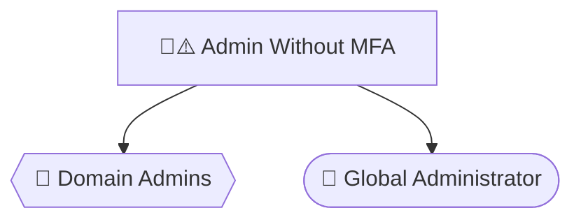

# Visual Diagram Generation Guide

## 🎨 Quick Start

### **Generate All Diagrams**
```powershell
.\script.ps1 -IncludeEntra -GenerateDiagrams
```

### **Generated Diagram Types**
1. **Privileged Access Map** - Users → Groups → Roles (with MFA status)
2. **GPO Topology** - GPOs ↔ OUs (with delegations)
3. **Trust Map** - Domain/forest trust relationships
4. **App & Grant Views** - Service Principals → OAuth Scopes

---

## 📊 **Diagram Formats**

| Format | File Extension | Best For | Requires |
|--------|---------------|----------|----------|
| **DOT** | `.dot` | Professional rendering, customization | Graphviz (to render) |
| **Mermaid** | `.mmd` | GitHub/GitLab, documentation | Nothing! |
| **PNG** | `.png` | Reports, presentations, quick viewing | Graphviz |

---

## 🔧 **Install Graphviz (Optional)**

### **Windows**
```powershell
# Using Chocolatey
choco install graphviz

# OR download installer
# https://graphviz.org/download/#windows
```

### **macOS**
```bash
brew install graphviz
```

### **Linux**
```bash
# Ubuntu/Debian
sudo apt-get install graphviz

# RHEL/CentOS
sudo yum install graphviz
```

### **Verify Installation**
```powershell
dot -V  # Should show version number
```

---

## 📁 **Output Files**

All diagram files are saved with timestamp in the output folder:

```
C:\Temp\ADScan\
├── privileged-access-map-20251007-120000.dot
├── privileged-access-map-20251007-120000.mmd
├── privileged-access-map-20251007-120000.png  (if Graphviz installed)
├── gpo-topology-20251007-120000.dot
├── gpo-topology-20251007-120000.mmd
├── gpo-topology-20251007-120000.png
├── trust-map-20251007-120000.dot
├── trust-map-20251007-120000.mmd
├── app-grant-views-20251007-120000.dot
└── app-grant-views-20251007-120000.mmd
```

---

## 🖼️ **Viewing Diagrams**

### **PNG Files** (Easiest)
```powershell
# View all PNG diagrams
Get-ChildItem "C:\Temp\ADScan" -Filter "*.png" | ForEach-Object {
    Invoke-Item $_.FullName
}
```

### **Mermaid Files** (GitHub/GitLab)
1. Copy mermaid file content:
   ```powershell
   Get-Content "C:\Temp\ADScan\privileged-access-map-*.mmd" | Set-Clipboard
   ```

2. **Option A**: Paste in markdown file:
   ````markdown
   ```mermaid
   {paste here}
   ```
   ````

3. **Option B**: View at [https://mermaid.live](https://mermaid.live)

4. **Option C**: Install Mermaid extension in VS Code and preview

### **DOT Files** (Advanced Rendering)
```powershell
# Render PNG
dot -Tpng input.dot -o output.png

# Render SVG (scalable)
dot -Tsvg input.dot -o output.svg

# Render PDF
dot -Tpdf input.dot -o output.pdf

# Different layouts
dot -Tpng input.dot -o output.png        # Hierarchical (default)
neato -Tpng input.dot -o output.png      # Spring model
fdp -Tpng input.dot -o output.png        # Force-directed
circo -Tpng input.dot -o output.png      # Circular layout
```

---

## 🎨 **Understanding Diagram Colors**

### **Risk Levels**
| Color | Icon | Risk Level | Meaning |
|-------|------|------------|---------|
| 🔴 Red | `#e74c3c` | **High** | Critical risks: No MFA, excessive permissions, external trusts |
| 🟡 Orange | `#e67e22` | **Medium** | Moderate risks: Service principals, many permissions, bidirectional trusts |
| 🟢 Green | `#2ecc71` | **Low** | Normal operations: MFA enabled, limited permissions, internal trusts |

### **Node Shapes**
| Shape | Represents | Used In |
|-------|------------|---------|
| 📦 **Box (rounded)** | Users | Privileged Access Map |
| ⬛ **Octagon** | AD Groups | Privileged Access Map |
| ⬡ **Hexagon** | Entra Roles | Privileged Access Map |
| 📁 **Folder** | GPOs | GPO Topology |
| ▭ **Rectangle** | OUs | GPO Topology |
| ◇ **Diamond** | OAuth Scopes | App & Grant Views |
| △ **Triangle** | Service Principals | App & Grant Views |
| ● **Ellipse** | Domains | Trust Map |
| ⬢ **Cylinder** | Forest Root | Trust Map |

---

## 📖 **Diagram Details**

### **1. Privileged Access Map** 🔐

**What It Shows**:
- Privileged users (box shape)
- AD privileged groups (octagon shape)
- Entra privileged roles (hexagon shape)
- Membership relationships (arrows)
- MFA status (⚠️ for no MFA, 🔐 for MFA enabled)

**Use Cases**:
- ✅ Identify admins without MFA
- ✅ Audit privileged group memberships
- ✅ Review Entra role assignments
- ✅ Plan MFA enforcement strategy

**Example Node Labels**:
```
🔴⚠️  John Smith (No MFA)
🟢🔐  Jane Doe (MFA Enabled)
🔴  Domain Admins (5 members)
🔴  Global Administrator (3 members)
```

---

### **2. GPO Topology** 📋

**What It Shows**:
- Group Policy Objects (folder shape)
- Organizational Units (rectangle shape)
- GPO→OU links (solid arrows)
- OU delegations (dashed arrows)

**Use Cases**:
- ✅ Identify unlinked GPOs (migration to Intune)
- ✅ Review OU delegation permissions
- ✅ Plan GPO consolidation
- ✅ Visualize policy scope

**Risk Indicators**:
- 🔴 Unlinked GPOs (orphaned policies)
- 🔴 OU delegations to non-admin groups
- 🟡 GPOs linked to many OUs

---

### **3. Trust Map** 🌐

**What It Shows**:
- Domains (ellipse shape)
- Forest roots (cylinder shape)
- External domains (diamond shape)
- Trust relationships (arrows with type labels)
- Trust direction (←, →, ↔)

**Use Cases**:
- ✅ Identify external trusts (lateral movement risks)
- ✅ Review trust types and directions
- ✅ Plan trust consolidation
- ✅ Assess attack surface

**Trust Types**:
- **Parent-Child**: Normal forest hierarchy (green)
- **Forest**: Cross-forest trust (orange)
- **External**: Cross-organization trust (red)
- **Shortcut**: Optimization trust (blue)

---

### **4. App & Grant Views** 🔑

**What It Shows**:
- Service principals (triangle shape)
- OAuth scopes/permissions (diamond shape)
- Grant relationships (arrows)
- Permission types (Application vs. Delegated)

**Use Cases**:
- ✅ Audit high-privilege app permissions
- ✅ Review admin-consented grants
- ✅ Identify over-permissioned apps
- ✅ Plan least-privilege enforcement

**High-Risk Permissions**:
- 🔴 `Directory.ReadWrite.All`
- 🔴 `RoleManagement.ReadWrite.Directory`
- 🔴 `Application.ReadWrite.All`
- 🟡 `Mail.ReadWrite`, `Files.ReadWrite.All`

---

## 🛠️ **Customization**

### **Edit Mermaid Diagrams**


### **Edit DOT Diagrams**


### **Custom Rendering**
```powershell
# High-DPI rendering
dot -Gdpi=300 -Tpng input.dot -o high-res.png

# Specific size
dot -Gsize=10,8\! -Tpng input.dot -o sized.png

# Transparent background
dot -Gbgcolor=transparent -Tpng input.dot -o transparent.png
```

---

## 📊 **Batch Processing**

### **Render All DOT Files**
```powershell
Get-ChildItem "C:\Temp\ADScan" -Filter "*.dot" | ForEach-Object {
    $pngPath = $_.FullName -replace '\.dot$', '.png'
    & dot -Tpng $_.FullName -o $pngPath
    Write-Host "✓ Rendered: $($_.Name)" -ForegroundColor Green
}
```

### **Convert to Multiple Formats**
```powershell
$dotFile = "privileged-access-map-20251007-120000.dot"

# Generate multiple formats
dot -Tpng $dotFile -o diagram.png
dot -Tsvg $dotFile -o diagram.svg
dot -Tpdf $dotFile -o diagram.pdf
dot -Tcmapx $dotFile -o diagram.map  # Image map for HTML

Write-Host "✓ Generated PNG, SVG, PDF, and image map"
```

---

## 💡 **Pro Tips**

### **1. Large Diagrams**
For environments with 100+ nodes:
```powershell
# Use different layout engines
fdp -Tpng large-diagram.dot -o output.png     # Better for large graphs
sfdp -Tpng large-diagram.dot -o output.png    # Scalable force-directed
```

### **2. Interactive Diagrams**
```powershell
# Generate SVG for interactive viewing
dot -Tsvg diagram.dot -o diagram.svg

# Open in browser - can zoom and inspect nodes
Start-Process "diagram.svg"
```

### **3. Embed in Reports**
```powershell
# Generate PNG at specific size for PowerPoint
dot -Gsize=10,7.5\! -Gdpi=150 -Tpng diagram.dot -o report-diagram.png
```

### **4. Automated Monthly Diagrams**
```powershell
# Schedule with Task Scheduler
$timestamp = Get-Date -Format "yyyy-MM"
$folder = "\\SharedDrive\Security\Assessments\$timestamp"

.\script.ps1 -IncludeEntra -GenerateDiagrams -OutputFolder $folder

# Convert to PDF for archive
Get-ChildItem $folder -Filter "*.dot" | ForEach-Object {
    $pdf = $_.FullName -replace '\.dot$', '.pdf'
    & dot -Tpdf $_.FullName -o $pdf
}
```

---

## 🚨 **Troubleshooting**

### **Problem: No PNG Files Generated**
**Solution**:
```powershell
# Check if Graphviz is installed
dot -V

# If not installed:
choco install graphviz

# Or download from:
# https://graphviz.org/download/
```

### **Problem: Diagrams Too Crowded**
**Solution**:
```powershell
# Use different layout
fdp -Tpng crowded-diagram.dot -o output.png

# Or increase spacing
dot -Granksep=2.0 -Tpng diagram.dot -o spaced.png
```

### **Problem: Mermaid Not Rendering in GitHub**
**Solution**:
- Ensure triple backticks with `mermaid` language identifier
- Check syntax at https://mermaid.live first
- GitHub Enterprise may require admin to enable Mermaid

### **Problem: Can't Open DOT Files**
**Solution**:
```powershell
# DOT files are text files, open with any editor
notepad diagram.dot
code diagram.dot  # VS Code
```

---

## 📚 **Resources**

### **Graphviz**
- 📘 **Official Site**: https://graphviz.org/
- 📥 **Download**: https://graphviz.org/download/
- 📖 **DOT Language Guide**: https://graphviz.org/doc/info/lang.html
- 🖼️ **Gallery**: https://graphviz.org/gallery/
- 📝 **Attributes**: https://graphviz.org/doc/info/attrs.html

### **Mermaid**
- 📘 **Official Site**: https://mermaid.js.org/
- 🎨 **Live Editor**: https://mermaid.live
- 📖 **Syntax Guide**: https://mermaid.js.org/intro/
- 🔧 **VS Code Extension**: [Mermaid Preview](https://marketplace.visualstudio.com/items?itemName=vstirbu.vscode-mermaid-preview)

### **Graph Theory**
- 📖 **Wikipedia**: https://en.wikipedia.org/wiki/Graph_theory
- 📘 **Directed Graphs**: https://en.wikipedia.org/wiki/Directed_graph
- 🎓 **Graph Visualization**: https://en.wikipedia.org/wiki/Graph_drawing

---

## 🎓 **Examples**

### **View Privileged Access Without MFA**
```powershell
# Generate diagrams
.\script.ps1 -IncludeEntra -GenerateDiagrams

# Open privileged access map
$png = Get-ChildItem "C:\Temp\ADScan" -Filter "*privileged-access*.png" | Select-Object -First 1
Invoke-Item $png.FullName

# Look for red nodes with ⚠️ symbol (no MFA)
```

### **Export for Executive Report**
```powershell
# Generate high-quality PDFs
Get-ChildItem "C:\Temp\ADScan" -Filter "*.dot" | ForEach-Object {
    $pdf = "C:\Reports\Diagrams\$($_.BaseName).pdf"
    & dot -Tpdf $_.FullName -o $pdf
}

# Results: Professional PDFs ready for board presentation
```

### **Track Changes Over Time**
```powershell
# Run monthly and keep diagrams
$month = Get-Date -Format "yyyy-MM"
.\script.ps1 -IncludeEntra -GenerateDiagrams -OutputFolder "C:\Archive\$month"

# Compare diagrams month-over-month
# "Did we reduce privileged users without MFA?"
```

---

**Last Updated**: October 7, 2025  
**Version**: 2.3  
**For More Help**: See TASK3-SUMMARY.md or README.md

