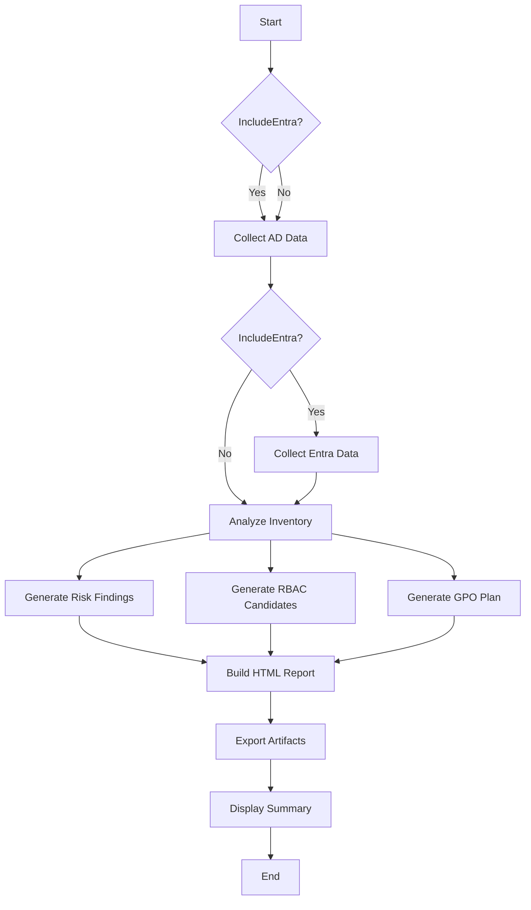

# Project Structure

## 📁 File Organization

```
AD_review/
│
├── script.ps1                    # Main assessment script (v2.0)
├── script2.ps1                   # Legacy analysis script (archived)
│
├── README.md                     # Project documentation
├── QUICKSTART.md                 # Quick setup & usage guide
├── PROGRESS.md                   # Development timeline & tracker
├── TODO.md                       # Task checklist
├── PROJECT_STRUCTURE.md          # This file
│
└── (Output files generated at runtime)
    ├── summary-{timestamp}.html
    ├── risk-findings-{timestamp}.csv
    ├── rbac-candidates-{timestamp}.csv
    ├── gpo-modernization-{timestamp}.csv
    ├── kpis-{timestamp}.json
    └── ... (30+ other exports)
```

---

## 📄 File Descriptions

### **Core Script**

#### `script.ps1` (Main Script - v2.0)
**Lines**: ~785  
**Purpose**: Comprehensive AD & Entra ID security assessment tool

**Key Functions**:
- `Write-OutputFiles` - Helper for CSV/JSON export
- `Get-LatestFile` - Find most recent export by pattern
- `Collect-ADInventory` - Active Directory data collection
- `Collect-EntraInventory` - Entra ID (Azure AD) data collection
- `Analyze-Inventory` - Security analysis engine (13 risk rules)

**Parameters**:
- `OutputFolder` - Where to save results (default: `$env:TEMP\ADScan`)
- `IncludeEntra` - Switch to enable Entra ID collection
- `MaxParallel` - Max parallel threads (default: 8)

**Workflow**:
1. Collect AD data (always)
2. Collect Entra data (if `-IncludeEntra`)
3. Run comprehensive analysis
4. Generate HTML report
5. Export CSV artifacts

---

### **Documentation Files**

#### `README.md`
**Purpose**: Comprehensive project documentation  
**Sections**:
- Project overview
- Completed features
- Requirements & setup
- Usage examples
- Output file reference
- Future roadmap (prioritized)
- Known issues & troubleshooting
- Contributing guide

**Audience**: New users, developers, stakeholders

---

#### `QUICKSTART.md`
**Purpose**: Get started in 5 minutes  
**Sections**:
- Installation steps
- Quick commands
- Understanding outputs
- Common scenarios
- Troubleshooting
- Best practices

**Audience**: First-time users, quick reference

---

#### `PROGRESS.md`
**Purpose**: Development timeline & metrics  
**Sections**:
- Date-stamped development log
- Completed tasks by session
- Current status & metrics
- Next steps (prioritized)
- Wins & lessons learned

**Audience**: Project team, management

---

#### `TODO.md`
**Purpose**: Task checklist & sprint planning  
**Sections**:
- High priority tasks
- Medium priority tasks
- Backlog
- Known issues
- Completed archive
- Sprint planning

**Audience**: Developers, project planning

---

#### `PROJECT_STRUCTURE.md` (This File)
**Purpose**: Navigate the project layout  
**Sections**:
- File tree
- File descriptions
- Code structure
- Output reference

**Audience**: New developers, code reviews

---

### **Legacy Files**

#### `script2.ps1` (Archived)
**Status**: Deprecated (functionality merged into script.ps1)  
**Purpose**: Original analysis-only script  
**Note**: Kept for reference, not actively maintained

---

## 🏗️ Code Structure (script.ps1)

### **1. Header & Help** (Lines 1-60)
- Synopsis & description
- Parameter documentation
- Usage examples
- Requirements & permissions

### **2. Parameters & Setup** (Lines 56-71)
- Parameter definitions
- Output folder creation
- Metadata capture
- Timestamp generation

### **3. Helper Functions** (Lines 37-53)
- `Write-OutputFiles` - Export CSV & JSON
- `Get-LatestFile` - Find latest export by pattern

### **4. AD Collection** (Lines 55-204)
`Collect-ADInventory` function:
- Forest/domain info
- Domain controllers
- Trust relationships
- Password policies (default & FGPP)
- Users (with delegation, logon history)
- Groups (with member counts)
- Computers (with OS, logon data)
- krbtgt password age
- Privileged group membership
- GPOs & links
- OU ACLs
- SPN accounts

**Outputs**: 15+ JSON/CSV files

### **5. Entra Collection** (Lines 207-332)
`Collect-EntraInventory` function:
- Tenant info
- Users (with sign-in activity)
- Groups
- Directory roles & assignments
- Service principals
- Applications
- OAuth2 permission grants
- App role assignments
- Conditional Access policies
- Sign-in logs (last 100)
- **Authentication methods (MFA)**

**Outputs**: 12+ JSON/CSV files

### **6. Analysis Engine** (Lines 336-631)
`Analyze-Inventory` function:

**Risk Rules (13)**:
1. Stale enabled accounts (>90 days)
2. PasswordNeverExpires flags
3. Kerberos delegation (users)
4. Unconstrained delegation (computers)
5. krbtgt password age (>180 days)
6. SPN/Kerberoast surface
7. Oversized groups (≥500 members)
8. Privileged role membership
9. No Conditional Access policies
10. Users without MFA
11. Legacy authentication sign-ins
12. Risky service principals
13. Admin-consented OAuth grants

**RBAC Clustering**:
- Groups users by identical AD group membership
- Generates seed roles (≥3 users per cluster)

**GPO Modernization**:
- Parses GPO XML for link counts
- Identifies unlinked GPOs (retire candidates)

**OU Delegation**:
- Analyzes ACLs for non-standard permissions
- Flags write access for non-admin principals

**Outputs**: 4 strategic artifacts
- `risk-findings-*.csv`
- `rbac-candidates-*.csv`
- `gpo-modernization-*.csv`
- `kpis-*.json`

### **7. Execution Flow** (Lines 633-785)
- Run AD collection
- Run Entra collection (if enabled)
- Call analysis engine
- Build HTML report (with fragments)
- Write summary file
- Display console output
  - Artifact locations
  - Risk summary by severity
  - Next steps

---

## 📊 Output Files Reference

### **Analysis Reports** (Strategic)
| File | Purpose | Format |
|------|---------|--------|
| `summary-{timestamp}.html` | Executive report | HTML |
| `risk-findings-{timestamp}.csv` | Prioritized findings | CSV |
| `rbac-candidates-{timestamp}.csv` | Suggested RBAC roles | CSV |
| `gpo-modernization-{timestamp}.csv` | GPO migration plan | CSV |
| `kpis-{timestamp}.json` | Key metrics | JSON |

### **AD Raw Data**
| File | Content | Format |
|------|---------|--------|
| `ad-users-{timestamp}.csv/json` | User inventory | Both |
| `ad-groups-{timestamp}.csv/json` | Group inventory | Both |
| `ad-computers-{timestamp}.csv/json` | Computer inventory | Both |
| `ad-gpos-{timestamp}.csv` | GPO list | CSV |
| `ad-gpo-links-{timestamp}.json` | GPO link details | JSON |
| `ad-spn-accounts-{timestamp}.csv` | SPN accounts | CSV |
| `ad-ou-acls-{timestamp}.json` | OU permissions | JSON |
| `ad-krbtgt-{timestamp}.json` | krbtgt status | JSON |
| `ad-privileged-groups-{timestamp}.json` | Privileged membership | JSON |
| `ad-trusts-{timestamp}.json` | Trust relationships | JSON |
| `ad-default-pwd-policy-{timestamp}.json` | Password policy | JSON |
| `ad-fgpp-{timestamp}.json` | Fine-grained policies | JSON |
| `forest-{timestamp}.json` | Forest info | JSON |
| `domain-{timestamp}.json` | Domain info | JSON |
| `dcs-{timestamp}.json` | Domain controllers | JSON |

### **Entra Raw Data**
| File | Content | Format |
|------|---------|--------|
| `entra-users-{timestamp}.csv/json` | User inventory | Both |
| `entra-groups-{timestamp}.csv/json` | Group inventory | Both |
| `entra-role-assignments-{timestamp}.json` | Directory roles | JSON |
| `entra-serviceprincipals-{timestamp}.csv/json` | Service principals | Both |
| `entra-apps-{timestamp}.csv/json` | Applications | Both |
| `entra-conditionalaccess-{timestamp}.json` | CA policies | JSON |
| `entra-oauth2-grants-{timestamp}.json` | OAuth grants | JSON |
| `entra-approle-assignments-{timestamp}.json` | App permissions | JSON |
| `entra-signins-{timestamp}.csv` | Sign-in logs | CSV |
| `entra-authmethods-{timestamp}.csv` | MFA coverage | CSV |
| `entra-tenant-{timestamp}.json` | Tenant info | JSON |

### **Metadata**
| File | Content | Format |
|------|---------|--------|
| `metadata-{timestamp}.json` | Collection metadata | JSON |

**Total Output Files**: 35+ files per run

---

## 🔍 Understanding the Workflow



---

## 🛠️ Extending the Script

### **Adding a New Risk Rule**
Location: `Analyze-Inventory` function (~line 360)

```powershell
# Template:
$yourCheck = $dataSource | Where-Object { $_.Property -eq 'BadValue' }
if ($yourCheck.Count -gt 0) {
    $findings.Add([pscustomobject]@{
        Area='Your Category'
        Finding="Description: $($yourCheck.Count) items"
        Severity='High|Medium|Low'
        Evidence='source-file-name'
    })
}
```

### **Adding a New Data Collection**
Location: `Collect-ADInventory` or `Collect-EntraInventory`

```powershell
# Template:
Write-Host "Collecting YourData..." -ForegroundColor Gray
$yourData = Get-ADObject -Filter * -Properties Prop1,Prop2 | 
            Select-Object Prop1,Prop2,@{n='Custom';e={$_.Prop1 + $_.Prop2}}
Write-OutputFiles -Name "your-data" -Object $yourData
```

### **Adding to HTML Report**
Location: After line 668 (in HTML body section)

```powershell
$yourHtml = $yourData | ConvertTo-Html -Fragment

# Add to $htmlBody:
<h2>Your Section</h2>
$yourHtml
```

---

## 📚 Dependencies

### **PowerShell Modules**
- `ActiveDirectory` (RSAT)
- `Microsoft.Graph.Authentication`
- `Microsoft.Graph.Identity.DirectoryManagement`
- `Microsoft.Graph.Users`
- `Microsoft.Graph.Groups`
- `Microsoft.Graph.Applications`
- `Microsoft.Graph.Identity.SignIns`
- `Microsoft.Graph.Reports`

### **Permissions Required**
- **AD**: Domain User (read access)
- **Entra**: 
  - Directory.Read.All
  - Application.Read.All
  - Policy.Read.All
  - AuditLog.Read.All
  - UserAuthenticationMethod.Read.All

---

## 🎯 Key Design Decisions

### **Why Two Scripts Initially?**
- `script.ps1` - Collection (fast, simple)
- `script2.ps1` - Analysis (flexible, reusable)
- **Merged** for better UX (single execution)

### **Why CSV + JSON?**
- CSV: Human-readable, Excel-friendly
- JSON: Complete data, API-ready

### **Why HTML Report?**
- Executive-friendly
- No additional tools needed
- Portable (single file)

### **Why RBAC Clustering?**
- Automates tedious role design
- Data-driven approach
- Provides starting point

---

**Last Updated**: October 3, 2025  
**Maintainer**: Security Assessment Team

